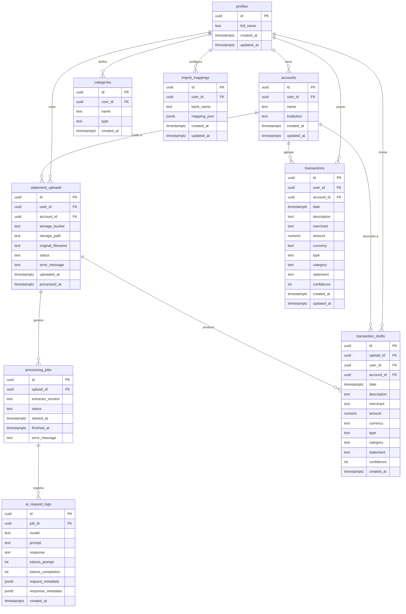

# Schema de Base de Datos — FinanceFlow

> **Fuente de verdad:** Este archivo describe el estado actual del schema en Supabase.
> Siempre consultar aquí antes de implementar un nuevo feature.
> Actualizar este archivo junto con cada migración.

**Última actualización:** 2026-03-17
**Migración más reciente:** `2026-03-17-initial-schema.sql`

---

## Diagrama de relaciones



---

## Tablas

### `profiles`
Extiende `auth.users` de Supabase. Se crea automáticamente al registrar un usuario.

| Columna | Tipo | Requerido | Descripción |
|---------|------|-----------|-------------|
| `id` | `uuid` | ✅ | FK a `auth.users.id` — mismo ID del usuario auth |
| `full_name` | `text` | — | Nombre completo del usuario |
| `created_at` | `timestamptz` | ✅ | Auto |
| `updated_at` | `timestamptz` | ✅ | Auto |

---

### `accounts`
Cuentas bancarias o financieras de un usuario.

| Columna | Tipo | Requerido | Descripción |
|---------|------|-----------|-------------|
| `id` | `uuid` | ✅ | PK generado |
| `user_id` | `uuid` | ✅ | FK a `profiles.id` |
| `name` | `text` | ✅ | Nombre de la cuenta (ej. "BBVA Débito") |
| `institution` | `text` | — | Banco o institución (ej. "BBVA") |
| `created_at` | `timestamptz` | ✅ | Auto |
| `updated_at` | `timestamptz` | ✅ | Auto |

**Índices:** `accounts_user_id_idx`

---

### `statement_uploads`
Registro de cada archivo subido (PDF o Excel). Punto de entrada del pipeline de importación.

| Columna | Tipo | Requerido | Descripción |
|---------|------|-----------|-------------|
| `id` | `uuid` | ✅ | PK |
| `user_id` | `uuid` | ✅ | FK a `profiles.id` |
| `account_id` | `uuid` | — | FK a `accounts.id` (nullable) |
| `storage_bucket` | `text` | ✅ | Bucket de Supabase Storage |
| `storage_path` | `text` | ✅ | Path del archivo en Storage |
| `original_filename` | `text` | — | Nombre original del archivo |
| `status` | `text` | ✅ | `uploaded` \| `processing` \| `ready_for_review` \| `imported` \| `failed` |
| `error_message` | `text` | — | Error si status=failed |
| `uploaded_at` | `timestamptz` | ✅ | Cuando se subió |
| `processed_at` | `timestamptz` | — | Cuando terminó el procesamiento |

**Índices:** `statement_uploads_user_id_idx`

---

### `processing_jobs`
Un job de extracción por cada upload procesado con AI.

| Columna | Tipo | Requerido | Descripción |
|---------|------|-----------|-------------|
| `id` | `uuid` | ✅ | PK |
| `upload_id` | `uuid` | ✅ | FK a `statement_uploads.id` |
| `extractor_version` | `text` | ✅ | Versión del extractor usado |
| `status` | `text` | ✅ | `queued` \| `running` \| `succeeded` \| `failed` |
| `started_at` | `timestamptz` | — | Cuando inició el job |
| `finished_at` | `timestamptz` | — | Cuando terminó |
| `error_message` | `text` | — | Error si status=failed |

**Índices:** `processing_jobs_upload_id_idx`

---

### `ai_request_logs`
Audit log de cada llamada a la AI (OpenAI). Útil para costos y debugging.

| Columna | Tipo | Requerido | Descripción |
|---------|------|-----------|-------------|
| `id` | `uuid` | ✅ | PK |
| `job_id` | `uuid` | ✅ | FK a `processing_jobs.id` |
| `model` | `text` | ✅ | Modelo usado (ej. "gpt-4o") |
| `prompt` | `text` | ✅ | Prompt enviado |
| `response` | `text` | — | Respuesta recibida |
| `tokens_prompt` | `int` | — | Tokens usados en prompt |
| `tokens_completion` | `int` | — | Tokens usados en respuesta |
| `request_metadata` | `jsonb` | — | Metadata de la request |
| `response_metadata` | `jsonb` | — | Metadata de la respuesta |
| `created_at` | `timestamptz` | ✅ | Auto |

**Índices:** `ai_request_logs_job_id_idx`

---

### `transaction_drafts`
Transacciones extraídas pendientes de revisión por el usuario.

| Columna | Tipo | Requerido | Descripción |
|---------|------|-----------|-------------|
| `id` | `uuid` | ✅ | PK |
| `upload_id` | `uuid` | ✅ | FK a `statement_uploads.id` |
| `user_id` | `uuid` | ✅ | FK a `profiles.id` |
| `account_id` | `uuid` | — | FK a `accounts.id` (nullable) |
| `date` | `timestamptz` | ✅ | Fecha de la transacción |
| `description` | `text` | ✅ | Descripción original del estado de cuenta |
| `merchant` | `text` | — | Comercio inferido por AI |
| `amount` | `numeric(12,2)` | ✅ | Monto. Negativo = egreso, positivo = ingreso |
| `currency` | `text` | ✅ | Default `MXN` |
| `type` | `text` | ✅ | `ingreso` \| `egreso` \| `inversión` \| `transferencia` |
| `category` | `text` | — | Categoría inferida por AI |
| `statement` | `text` | — | Identificador del estado de cuenta origen |
| `confidence` | `int` | — | Score de confianza de la extracción (0-100) |
| `created_at` | `timestamptz` | ✅ | Auto |

**Índices:** `transaction_drafts_upload_id_idx`

---

### `transactions`
Transacciones confirmadas y permanentes.

| Columna | Tipo | Requerido | Descripción |
|---------|------|-----------|-------------|
| `id` | `uuid` | ✅ | PK |
| `user_id` | `uuid` | ✅ | FK a `profiles.id` |
| `account_id` | `uuid` | — | FK a `accounts.id` (nullable) |
| `date` | `timestamptz` | ✅ | Fecha de la transacción |
| `description` | `text` | ✅ | Descripción |
| `merchant` | `text` | — | Comercio |
| `amount` | `numeric(12,2)` | ✅ | Monto (negativo = egreso) |
| `currency` | `text` | ✅ | Default `MXN` |
| `type` | `text` | ✅ | `ingreso` \| `egreso` |
| `category` | `text` | — | Categoría |
| `statement` | `text` | — | Estado de cuenta origen |
| `confidence` | `int` | — | Confianza de clasificación |
| `created_at` | `timestamptz` | ✅ | Auto |
| `updated_at` | `timestamptz` | ✅ | Auto |

**Índices:** `transactions_user_id_idx`, `transactions_account_id_idx`, `transactions_date_idx`

---

### `categories`
Categorías personalizadas por usuario para analytics y clasificación.

| Columna | Tipo | Requerido | Descripción |
|---------|------|-----------|-------------|
| `id` | `uuid` | ✅ | PK |
| `user_id` | `uuid` | ✅ | FK a `profiles.id` |
| `name` | `text` | ✅ | Nombre de la categoría |
| `type` | `text` | ✅ | `expense` \| `income` \| `investment` \| `transfer` |
| `created_at` | `timestamptz` | ✅ | Auto |

**Índice único:** `(user_id, name)`

---

### `import_mappings`
Configuración de mapeo de columnas por banco. Permite recordar cómo mapear los campos de cada banco.

| Columna | Tipo | Requerido | Descripción |
|---------|------|-----------|-------------|
| `id` | `uuid` | ✅ | PK |
| `user_id` | `uuid` | ✅ | FK a `profiles.id` |
| `bank_name` | `text` | ✅ | Identificador del banco (único) |
| `mapping_json` | `jsonb` | ✅ | Mapeo `{ columna_origen: campo_destino }` |
| `created_at` | `timestamptz` | ✅ | Auto |
| `updated_at` | `timestamptz` | ✅ | Auto |

---

## Row Level Security (RLS)

**Estado actual:** ⚠️ Sin implementar (pendiente Sprint 4)

Cuando se implemente Supabase Auth, cada tabla necesita una política RLS:

```sql
-- Patrón estándar para todas las tablas con user_id
ALTER TABLE public.[tabla] ENABLE ROW LEVEL SECURITY;
CREATE POLICY "[tabla] owner access" ON public.[tabla]
  FOR ALL USING (auth.uid() = user_id)
  WITH CHECK (auth.uid() = user_id);
```

Ver el SQL completo en `docs/db/migrations/2026-03-17-rls-policies.sql` (pendiente).

---

## Pipeline de importación

El flujo completo de un estado de cuenta:

```
1. Usuario sube archivo (PDF/Excel)
        ↓
2. statement_uploads → status: "uploaded"
        ↓
3. processing_jobs → status: "queued" → "running"
        ↓
4. AI extrae transacciones → ai_request_logs registra cada llamada
        ↓
5. transaction_drafts ← filas pendientes de revisión
        ↓
6. Usuario revisa y confirma
        ↓
7. transactions ← filas confirmadas
   statement_uploads → status: "imported"
```

---

## Cómo agregar un nuevo feature

1. **Consulta este archivo** para entender las relaciones entre tablas
2. **Crea el PRD** en `docs/prd/YYYY-MM-DD-nombre-feature.md`
3. **Si hay cambios de schema:**
   - Escribe el SQL en `docs/db/migrations/YYYY-MM-DD-descripcion.sql`
   - Aplícalo en **Supabase → SQL Editor**
   - Registra el cambio en `docs/db/MIGRATIONS.md`
   - Actualiza este archivo (`schema.md`)
   - Actualiza `prisma/schema.prisma` para reflejar los cambios
4. **Crea el feature** en `features/[nombre]/`
5. **Actualiza el PRD** con estado `implementado`
